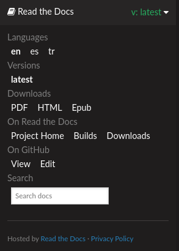

# Toolkit for Minority/Low-resource Languages: Documentation

This is the source of the online document that is hosted [here](https://language-toolkit.readthedocs.io/en/latest/). It is built using Sphinx and the repository was forked from "the template for the Read the Docs tutorial". 

# Basics

As the `rst` files in the repo are updated, the online document is updated automatically. Same applies for the translations (explained below). In order to intruduce the content to the repository, a local installation is advised.

# Local installation

Setup the virtual environment and install the requirements

```
python -m venv venv
source venv/bin/activate
pip install -r requirements.txt
```

That's it!

# Re-compile the documentation

For a local compilation, all that is needed is to launch

```
<project>/docs$ make html
```

from the `docs` directory. All the html files appear in the `<project>/build/html/` directory. 

If everything is building correctly, in order for the changes to appear on the website [here](https://language-toolkit.readthedocs.io/en/latest/), just push the changes to github.

# Translations

Once `rst` files are modified, the changes only apply for the parent, English version. These changes have to be introduced in the translation `.po` files. Luckily this repository has the internationalization already setup, both in the pushed files and the virtual enviroment requirements.

Once the changes to the `rst` files are made just execute

```
<project>/docs/source$ sphinx-build -b gettext . _build/gettext
<project>/docs/source$ sphinx-intl update -p _build/gettext -l es -l tr
```

The first command builds the templates `.pot` files and the second one updates the actual `.po` files to be translated. Both have to be executed from `<project>/docs/source`. All the final `.po` files will appear at `<project>/docs/source/locales`. These files have to be translated either manually via a local tool like `poedit` or sent to a translation platform like transifex (which is free for open source projects), and has to be translated by the translators.

# Build the translated pages

Before pushing the translated to the repository it might be a good idea to build the translated pages. For more information check the [official tutorial](https://docs.readthedocs.io/en/stable/guides/manage-translations-sphinx.html).

```
sphinx-build -b html -D language=tr . _build/html/tr
sphinx-build -b html -D language=es . _build/html/es
```

Pushing the `.po` files will create the new versions of the readthedocs translated pages [Spanish here](https://language-toolkit.readthedocs.io/es/latest/), [Turkish here](https://language-toolkit.readthedocs.io/tr/latest/). The different languages are also accesible from the footer menu. 



For more information read the tutorial here:

https://docs.readthedocs.io/en/stable/tutorial/
