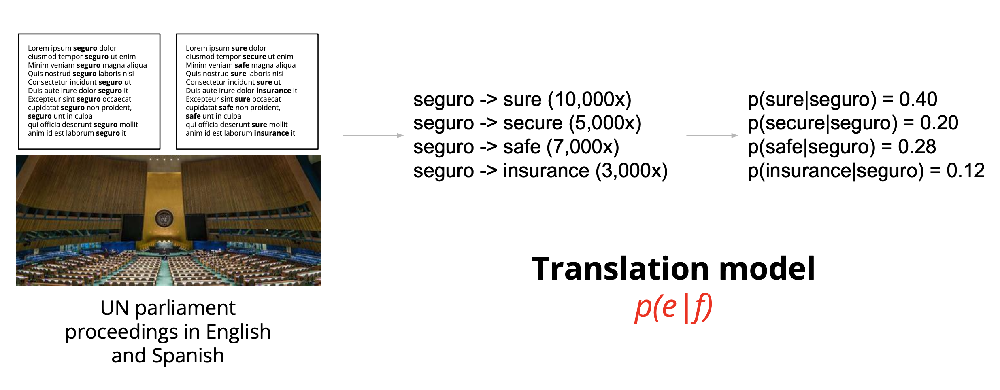
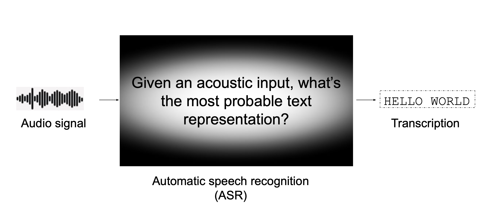

Data-driven language technologies
=================================

The digital revolution is here with us and Artificial Intelligence (AI) is a key technological enabler as it offers a range of new opportunities to break down existing barriers to human development and social inclusion. One are that is powered by AI is Language technology which makes it possible to interact with our phones through digital assistants, translate websites and documents with a few clicks, increase accessibility of videos with automatic captioning etc.

The main motor behind these is the advancement of the field **Natural Language Processing (NLP)**. But what does NLP entail? Here's a list of core technologies that fall in the area of this field:

Text-based: 

- Machine translation
- Information retrieval
- Sentiment analysis
- Information extraction
- Question answering
- Text summarization
- Named-entity recognition

Speech-based:

- Automatic speech recognition
- Text-to-speech synthesis

The revolutionary aspect of these technologies is that they are *data-driven*, which means that the intelligence that is created with these tools are collected from large volumes of information--or simply *data*. For example, in the case of machine translation, the engine "models" translation from a language to the other by looking at a collection of human-translated documents and sentences. Similarly a *sentinment analyzer* learns how to label if a tweet says good or bad about a company from thousands of tweets labelled by humans as carrying a good or bad sentiment.

This dependency on data is what makes these technologies accessible to some languages and not to the others. The available resources for a language directly influences the possibility of developing an application for a language. As the greatest resource of textual data is the internet, and it is dominated by a few languages, these technologies tend to focus on only a handful of *power languages* e.g. English, Spanish, Chinese, Arabic etc.

The diagram below by `Microsoft Research Labs India <https://www.microsoft.com/en-us/research/publication/ellora-enabling-low-resource-languages-with-technology/>`_ illustrates the hierarchy created by this "power-law" among languages.

.. figure:: img/ellora.png
	:alt: Classification of languages according to the availability of language technology, tools and resources
	:align: center

	Classification of languages according to the availability of language technology, tools and resources

Machine translation
-------------------

Machine Translation (MT) is defined as the automatic conversion of a sequence of symbols in one language to a sequence of symbols in another language. It has evolved through years from rule-based to statistical approaches, which modeled the probabilities of mappings between sub-phrases between translations. These probabilities are learned in a statistical fashion from parallel texts where sentence-aligned translations are available in the languages involved (referred as source and target languages). The diagram below illustrates the modelling of translating the word "sure" in English to Spanish using translations made in the UN Parliament.

	Extracting statistics of translations from parallel data

Machine translation services like Google Translate and DeepL have made their way into reliable tools for translators and also regular folk in the recent years. This is largely due to the advancement of *deep learning* techniques that revolutionized the artificial intelligence field. This new way of modelling introduced in 2014 made 50% fewer word order mistakes, 17% fewer lexical mistakes, 19% fewer grammar mistakes compared to earlier models.

The uses of machine translation are as follows: 

	1. **Assimilation**, emulating a certain document in another language. This use-case enables e.g. reading a news site or technical paper in a language that we don't understand. We know that it's not a 100% accurate translation, but it gives the gist to explore further more.
	2. **Communication**, enabling the communication between individuals and organizations e.g. in chat, tourism, e-commerce, lowering the need for a lingua franca.
	3. **Monitoring**, enabling tracing of information in large-scale multilingual documents e.g. discovering international trends in Twitter. 
	4. **Assistance**, improving translation workflows e.g. computer-assisted translation, post-editing.

MT has also become an essential tool in language learning. `A recent work by Duke University <https://ojs.uv.es/index.php/attic/article/view/2228>`_ studies their usage among university level language learners beside other classic tools like dictionaries and thesauri. They report that 76% of the students enrolled in a Spanish class use web-based MT tools like Google Translate during their studies. 

Finally, MT has also been proposed as a documentation and preservation tool for endangered languages by Bird and Chiang in their paper `Machine translation for language preservation <https://aclanthology.org/C12-2013/>`_. Directly quoting from their paper: "... when source texts are translated into a major world language, we guarantee that the language documentation will be interpretable even after the language has fallen out of use. Second, when a surviving speaker can identify errors in the output of an MT system, we have timely evidence of those areas of grammar and lexicon that need better coverage while there is still time to collect more. These tasks of producing and correcting translations can be performed by speakers of the language without depending on the intervention of outside linguists. Furthermore, we sidestep the need for linguistic resources like treebanks and wordnets, which are expensive to create and which depend on the existence of morphological, syntactic, and semantic analyses of the language."

This innovative way of language documentation reduces the effort into mere translation collection since MT development relies on this type of data. 

Automatic speech recognition
----------------------------

Automatic speech recognition (ASR) is the conversion of speech in its acoustic form into a symbolic form such as words or letters. It is the probabilistic modelling of the question ”What is the most probable word sequence among all possible word sequences given an acoustic input?”. Diagram below illustrates this process. Speech signal captured by a microphone is first encoded into a sequence of acoustic feature vectors. Following, the acoustic feature vectors are decoded into the words that represent the linguistic information that lies in the speech signal.

	A simple diagram of automatic speech recognition

Developing an automatic speech recognition system for a language is dependant on the following type of data: 

	1. Collection of short speech audio recordings from many speakers and their text transcriptions
	2. A large text corpus
	3. Phonetic pronunciation dictionary (This is optional in more modern technologies)

ASR has progressed significantly in the last decade again thanks to the advent of deep-learning. In September 2017, Microsoft announced `their results <https://www.microsoft.com/en-us/research/publication/toward-human-parity-conversational-speech-recognition/>`_ for an English speech recognition system that could achieve better-than-human performance in speech transcription. Their system was based on a dataset of 200M transcribed words from conversational speech. These developments have had great impact already as virtual assistants have become a cotidian application, voice search and automatic transcription of audio.
		
Text-to-speech
--------------

Text-to-speech (or speech synthesis) involves production of a human-like speech given a text input with a computer. Before the advent of deep learning, there were two main approaches to text-to-speech (TTS) synthesis: concatenative TTS, and parametric TTS. Concatenative TTS, also called unit selection, combines short pre-recorded audio clips called units to synthesise the desired text. Concatenative TTS can provide a good performance in terms of speech quality but the cut and stitch procedure means a lack of naturalness. Parametric TTS relies on statistical methods by generating speech with a combination of parameters like F0 and energy, modelling the human speech production.

Currently, most modern TTS systems rely on deep-learning methods. The deep neural networks are trained using a large amount of recorded speech and the associated text transcriptions. In contrast to ASR training data, they are usually collected from a single speaker. The resulting TTS system is able to replicate the voice of this particular speaker. 

TTS is important in making computers accessible to blind or partially sighted people as it enables them to "read" from the screen. TTS technology can be linked to any written input in a variety of languages, e.g. automatic pronunciation of words from an online dictionary, reading aloud of a text, interface for a voice assistant etc.

In the case of endangered and minority languages, TTS can aid language learning and language documentation. Students who don't have access to speakers can study how a sentence is pronounced without assistance from a tutor. It is a permanent record of the language as it will persist even after the moment there are no speakers left for the language. 

.. Low-resource technologies
.. ~~~~~~~~~~~~~~~~~~~~~~~~~
